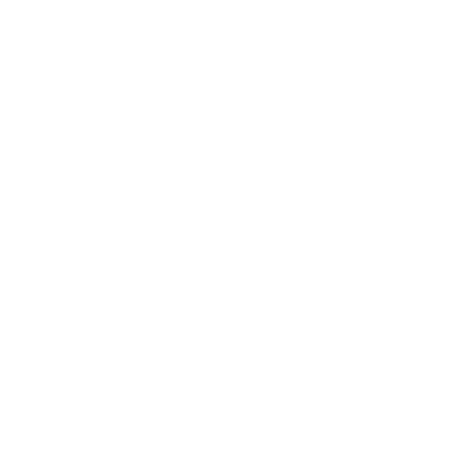

## Hi, I'm Moser José 

_`"Work hard in silence and let your success make the noise. - Dale Carnegie"`_<be>

 

 

- :seedling: &nbsp;I’m currently studing an MBA in Software Engineering at **[@USP]**
- :book: &nbsp;Learn more about me in my website **[blog]**
- :mailbox: &nbsp;Ask me anything on my **[issues page]**
- :computer: &nbsp;Connect with me on **[LinkedIn]**

 
 
 

<h2 align="left" id="moser-jose">Favorite Tech</h2>

> Tools, languages, and other things that I like to work with.

<table>
  <tr>
    <td align="center" width="96">
      
       Python
    </td>
    <td align="center" width="96">
      
       Javascript
    </td>
    <td align="center" width="96">
      
       TypeScript
    </td>
    <td align="center" width="96">
      
       PHP
    </td>
    <td align="center" width="96">
      
       React.js
    </td>
    <td align="center" width="96">
      
       React Native
    </td>
    <td align="center" width="96">
      
       Remix
    </td>
    <td align="center" width="96"> 
      
       Next.js
    </td>
    <td align="center"  width="96">
      
       Expo
    </td>
    <td align="center" width="96">
      
       Laravel
    </td>
  </tr>
    <tr>
    <td align="center" width="96">
      
       Docker
    </td>
    <td align="center" width="96">
      
       AWS
    </td>
    <td align="center" width="96">
      
       Node.js
    </td>
    <td align="center" width="96">
      
       Graphql
    </td>
    <td align="center" width="96">
      
       PostgreSQL
    </td>
    <td align="center" width="96">
      
       Nestjs
    </td>
    <td align="center" width="96">
      
       Jest
    </td>
    <td align="center" width="96"> 
      
       Prisma
    </td>
    <td align="center"  width="96">
      
       Tailwind
    </td>
    <td align="center" width="96">
      
       Zustand
    </td>
  </tr>
</table>

## Published Articles :bookmark:

<ul>
  
  <li>
     <a href="https://revista.ispsn.org/index.php/rsn/article/view/216" >
     Um Estudo Comparativo Sobre a Performance de Mecanismos de Segurança em Dispositivos da Internet das Coisas
    </a>
  </li>
    <li>
     <a href="https://doi.org/10.20944/preprints202306.0529.v1" >
       A Comparative Study on the Performance of Security Mechanisms in Internet of Things Devices
    </a>
    </li>
  <li>
     <a href="https://doi.org/10.1145/3339252.3340514" >
       IoT-HarPSecA: A Framework for Facilitating the Design and Development of Secure loT Devices
    </a>
  </li>
</ul>

<h2 align="left" id="moser-jose">Now Playing on Spotify 🎧</h2>

<!-- links -->

[@USP]: https://usp.br "USP Home"
[issues page]: https://github.com/moser-jose/moser-jose/issues "moser-jose/issues"
[linkedin]: https://www.linkedin.com/in/moser-jose "Moser José LinkedIn"
[website]: https://moserjose.com "Moser José/website"
[blog]: https://moserjose.com "My Blog"
